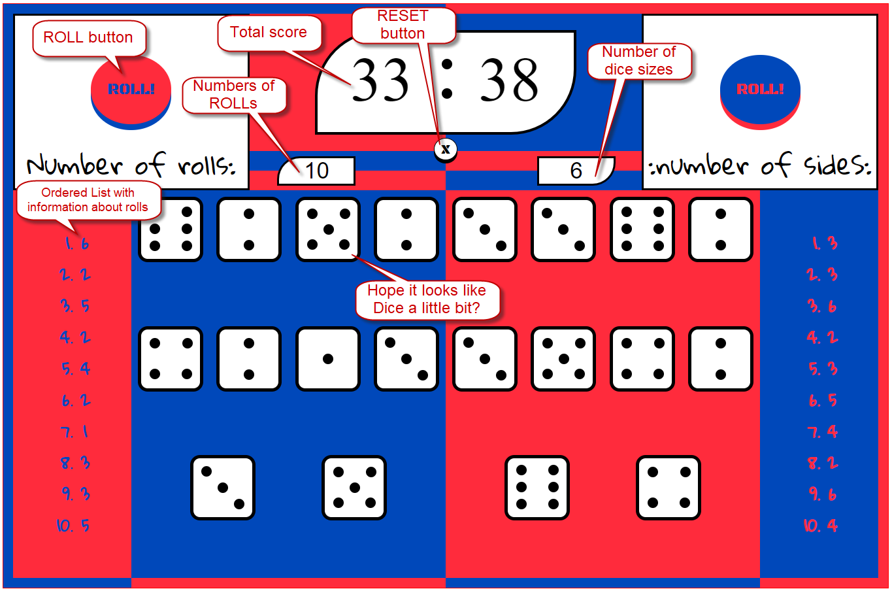
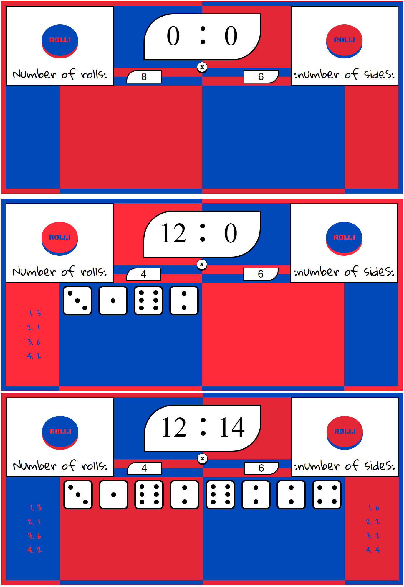
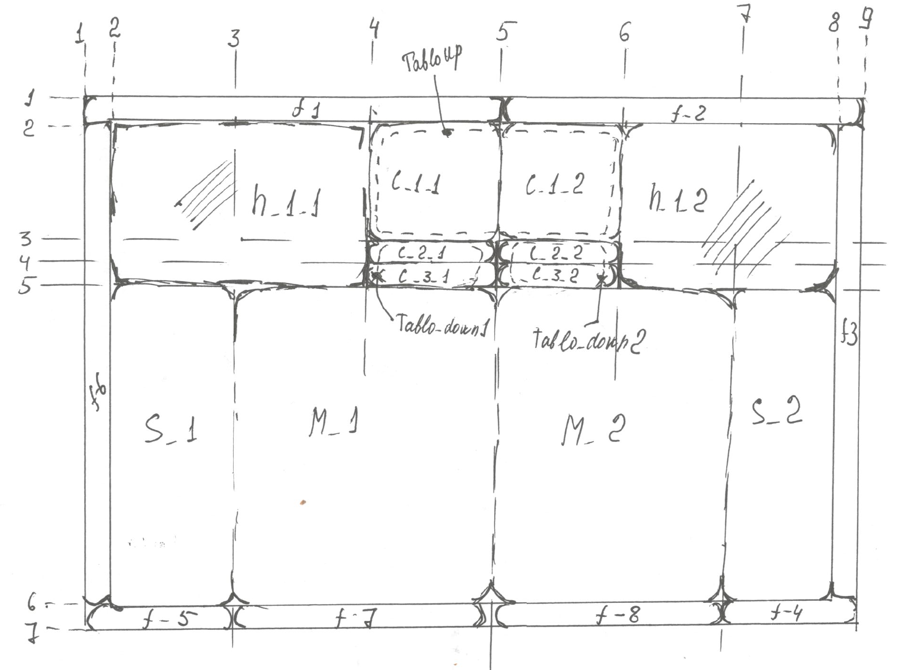

## Dice Roller game

Let's play a little bit)

## Actions in Game

###### Initial data
* number of rolls
* number of dice sides

###### 1. "ROLL" button:
 * roll dices using Math.random().
 *  calculate and display the total sum of numbers in current roll.
 *  create and display the ordered list with results of current dice roll.
 *  generate and display the graphical form of dices.
 *  change ColorStyle of document with 0.5 sec. delay

###### 1. "RESET" button:
 *  clear both Ordered Lists and all generated Dices.
 *  reset the total sum - to zero.
 *  change ColorStyle of document with 0.5 sec. delay

## Change colors in Game

## All dreams start as a draft

